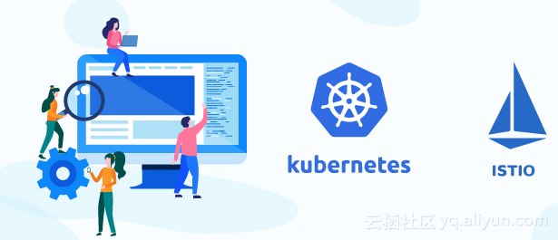
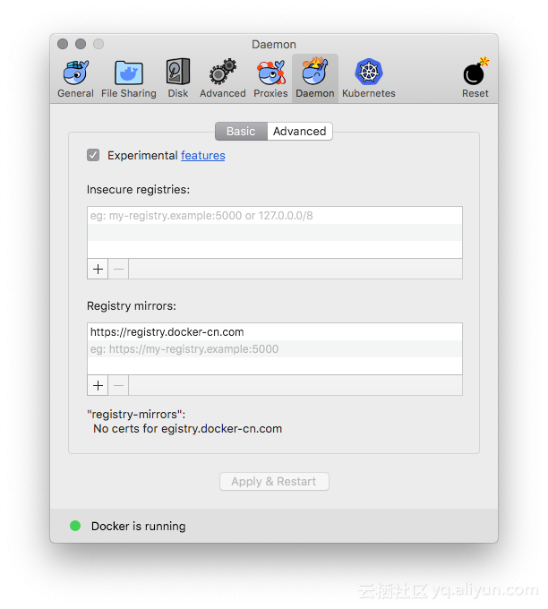
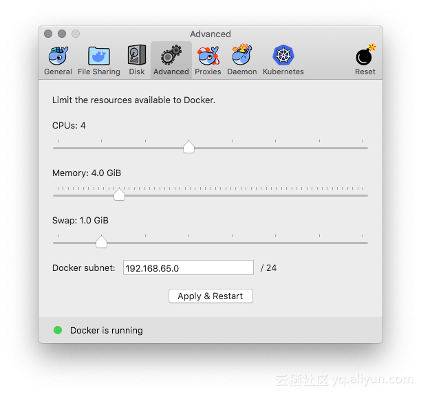
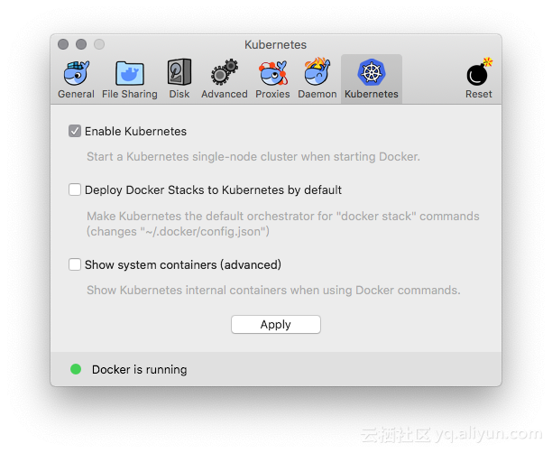
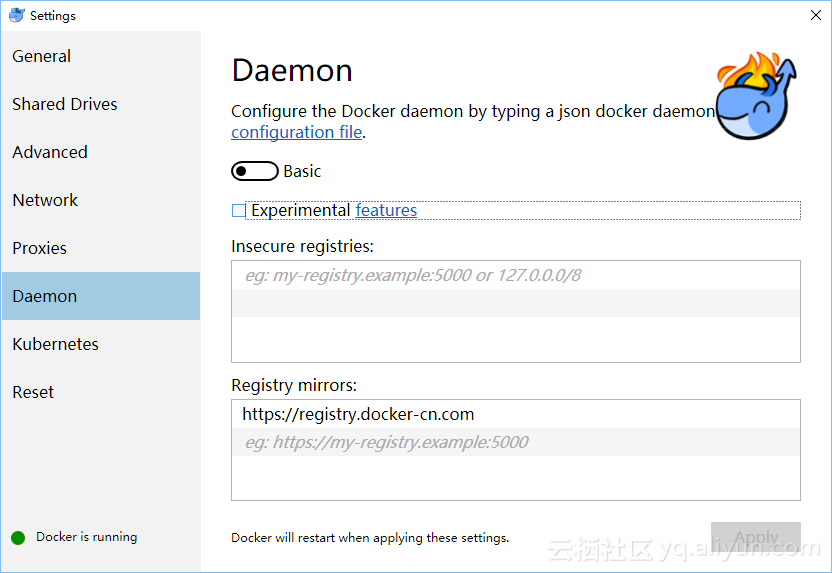
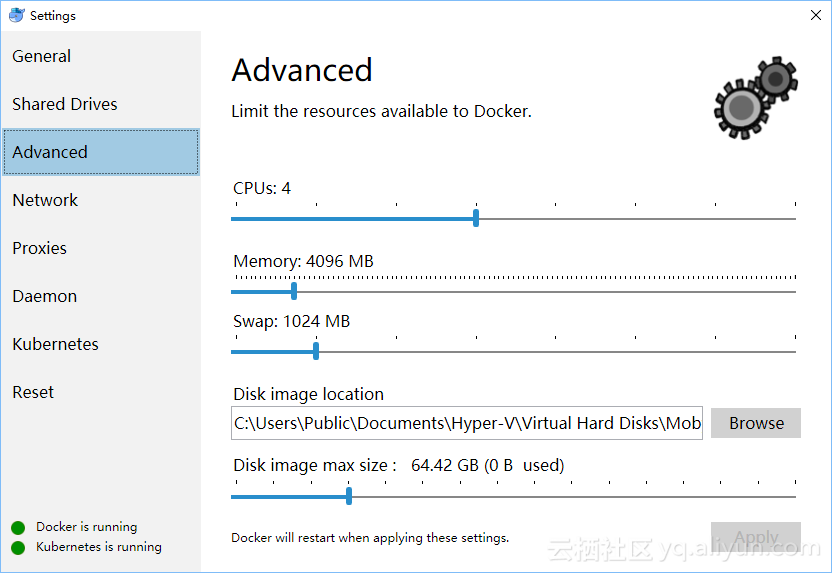
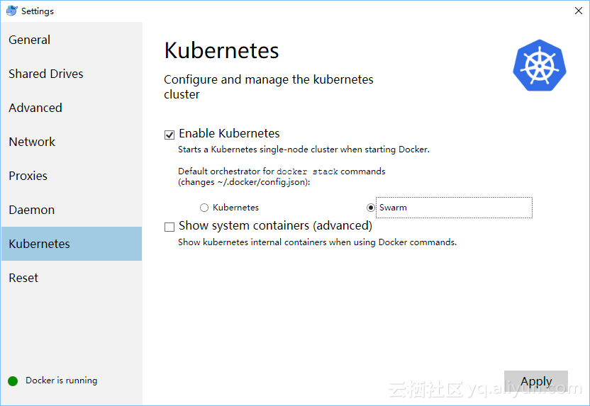
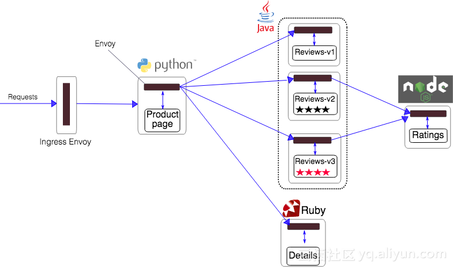

# 15分钟在笔记本上搭建 Kubernetes + Istio开发环境

**简介：** 11月13~15日，KubeCon 上海大会召开，云原生是这个秋天最火热的技术。很多同学来问如何上手 Kubernetes和Istio 服务网格开发。本文将帮助你利用Docker CE桌面版，15分钟在笔记本上从零搭建 Kubernetes + Istio开发环境，开启云原生之旅。



11月13~15日，KubeCon 上海大会召开，云原生是这个秋天最火热的技术。很多同学来问如何上手 Kubernetes和Istio 服务网格开发。本文将帮助你利用Docker CE桌面版，15分钟在笔记本上从零搭建 Kubernetes + Istio开发环境，开启云原生之旅。

说明：本文测试通过环境 Docker CE 18.09 (Kubernetes 1.10.3) 以及 Istio 1.0.4

**先决条件**，你需要一个 Docker for Mac或者Docker for Windows的安装包，如果没有请下载[下载 Docker CE最新版本](https://store.docker.com/search?type=edition&offering=community)。由于Kubernetes大量的容器镜像在 gcr.io， 无法在国内保证稳定的访问。我们提供了一些[工具脚本](https://github.com/AliyunContainerService/k8s-for-docker-desktop)，帮助从阿里云镜像服务下载所需镜像

首先，

```
git clone https://github.com/AliyunContainerService/k8s-for-docker-desktop
cd k8s-for-docker-desktop
```

### Docker for Mac 开启 Kubernetes

为 Docker daemon 配置 Docker Hub 的中国官方镜像加速 `https://registry.docker-cn.com`



可选操作: 为 Kubernetes 配置 CPU 和 内存资源，建议分配 4GB 或更多内存。



预先从阿里云Docker镜像服务下载 Kubernetes 所需要的镜像, 可以通过修改 `images.properties` 文件加载你自己需要的镜像

```
./load_images.sh
```

开启 Kubernetes，并等待 Kubernetes 开始运行



### Docker for Windows 开启 Kubernetes

为 Docker daemon 配置 Docker Hub 的中国官方镜像加速 `https://registry.docker-cn.com`



可选操作: 为 Kubernetes 配置 CPU 和 内存资源，建议分配 4GB 或更多内存。



预先从阿里云Docker镜像服务下载 Kubernetes 所需要的镜像, 可以通过修改 `images.properties` 文件加载你自己需要的镜像

使用 Bash shell

```
./load_images.sh
```

使用 PowerShell

```
 .\load_images.ps1
```

说明: 如果因为安全策略无法执行 PowerShell 脚本，请在 “以管理员身份运行” 的 PowerShell 中执行 `Set-ExecutionPolicy RemoteSigned` 命令。

开启 Kubernetes，并等待 Kubernetes 开始运行



### 配置 Kubernetes

可选操作: 切换Kubernetes运行上下文至 docker-for-desktop

```
kubectl config use-context docker-for-desktop
```

验证 Kubernetes 集群状态

```
kubectl cluster-info
kubectl get nodes
```

部署 Kubernetes dashboard

```
kubectl create -f https://raw.githubusercontent.com/kubernetes/dashboard/master/src/deploy/recommended/kubernetes-dashboard.yaml
```

或

```
kubectl create -f kubernetes-dashboard.yaml
```

开启 API Server 访问代理

```
kubectl proxy
```

通过如下 URL 访问 Kubernetes dashboard

http://localhost:8001/api/v1/namespaces/kube-system/services/https:kubernetes-dashboard:/proxy/#!/overview?namespace=default

说明：如果测试 Istio，不需要安装 Ingress，如果需要 Ingress 可以参考 https://github.com/AliyunContainerService/k8s-for-docker-desktop 中 Ingress相关章节

### 安装 Helm

可以根据文档安装 helm https://github.com/helm/helm/blob/master/docs/install.md

#### 在 Mac OS 上安装

```
# Use homebrew on Mac
brew install kubernetes-helm

# Install Tiller into your Kubernetes cluster
helm init --upgrade -i registry.cn-hangzhou.aliyuncs.com/google_containers/tiller:v2.11.0 --skip-refresh

# update charts repo (Optional)
helm repo update
```

#### 在Windows上安装

```
# Use Chocolatey on Windows
choco install kubernetes-helm

# Install Tiller into your Kubernetes cluster
helm init --upgrade -i registry.cn-hangzhou.aliyuncs.com/google_containers/tiller:v2.11.0 --skip-refresh

# update charts repo (Optional)
helm repo update
```

### 配置 Istio

可以根据文档安装 Istio https://istio.io/docs/setup/kubernetes/

#### 下载 Istio 1.0.4 并安装 CLI

```
curl -L https://git.io/getLatestIstio | sh -
cd istio-1.0.4/
export PATH=$PWD/bin:$PATH
```

在Windows上，您可以手工下载Istio安装包，或者把`getLatestIstio.ps1`拷贝到你希望下载 Istio 的目录，并执行 - 说明：根据社区提供的[安装脚本](https://gist.github.com/kameshsampath/796060a806da15b39aa9569c8f8e6bcf)修改而来

```
.\getLatestIstio.ps1
```

#### 通过 Helm chart 安装 Istio

```
helm install install/kubernetes/helm/istio --name istio --namespace istio-system
```

#### 查看 istio 发布状态

```
helm status istio
```

#### 为 `default` 名空间开启自动 sidecar 注入

```
kubectl label namespace default istio-injection=enabled
kubectl get namespace -L istio-injection
```

#### 安装 Book Info 示例

```
kubectl apply -f samples/bookinfo/platform/kube/bookinfo.yaml
kubectl apply -f samples/bookinfo/networking/bookinfo-gateway.yaml
```

确认示例应用在运行中

```
export GATEWAY_URL=localhost:80
curl -o /dev/null -s -w "%{http_code}\n" http://${GATEWAY_URL}/productpage
```

可以通过浏览器访问

http://localhost/productpage

说明：如果当前80端口已经被占用或保留，我们可以编辑 `install/kubernetes/helm/istio/values.yaml` 文件中
Gateway 端口进行调整，比如将 80 端口替换为 8888 端口

```
      ## You can add custom gateway ports
    - port: 8888  # Changed from 80
      targetPort: 80
      name: http2
      nodePort: 31380
```

然后执行如下命令并生效

```
kubectl delete service istio-ingressgateway -n istio-system
helm upgrade istio install/kubernetes/helm/istio
```

#### 学习 Istio

大家参照 Istio 开始学习吧， https://istio.io/zh/docs/examples/bookinfo/



#### 删除实例应用

```
samples/bookinfo/platform/kube/cleanup.sh
```

### 卸载 Istio

```
helm del --purge istio
kubectl delete -f install/kubernetes/helm/istio/templates/crds.yaml -n istio-system
```

## 总结

[阿里云Kubernetes服务 (ACK)](https://www.aliyun.com/product/kubernetes) 已经对 Istio提供了支持，并将Istio和阿里云进行了深度整合，比如可以通过阿里云日志服务支持基于Jaeger的全链路监控，基于云监控提升Istio可观测性和报警能力等。后续也将进一步简化Kubernetes和Istio的开发者体验，让大家方便地把 Kubernetes + Istio 应用无缝迁移上云。

## 拓展阅读

- [Kubernetes 中文文档](https://kubernetes.io/zh/)
- [Istio 中文文档](https://istio.io/zh/)
- [Istio官方文档 - 阿里云Kubernetes服务 (ACK)支持](https://istio.io/docs/setup/kubernetes/quick-start-alicloud-ack/)
- [阿里云 Kubernetes服务上的Istio实践](https://help.aliyun.com/document_detail/90563.html)
- [阿里云容器服务团队博客 Istio 实践系列文章 - 持续更新中](https://yq.aliyun.com/teams/11/type_blog-cid_349-page_1)
- [ServiceMesher社区](http://www.servicemesher.com/)

**版权声明：**本文内容由阿里云实名注册用户自发贡献，版权归原作者所有，阿里云开发者社区不拥有其著作权，亦不承担相应法律责任。具体规则请查看《[阿里云开发者社区用户服务协议](https://developer.aliyun.com/article/768092)》和《[阿里云开发者社区知识产权保护指引](https://developer.aliyun.com/article/768093)》。如果您发现本社区中有涉嫌抄袭的内容，填写[侵权投诉表单](https://yida.alibaba-inc.com/o/right)进行举报，一经查实，本社区将立刻删除涉嫌侵权内容。