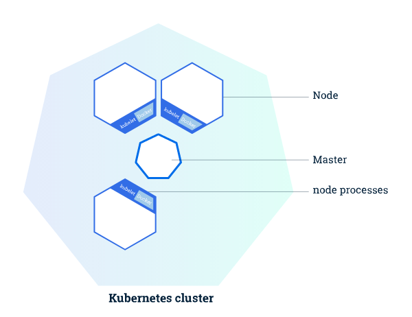
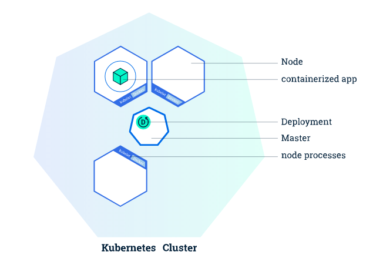
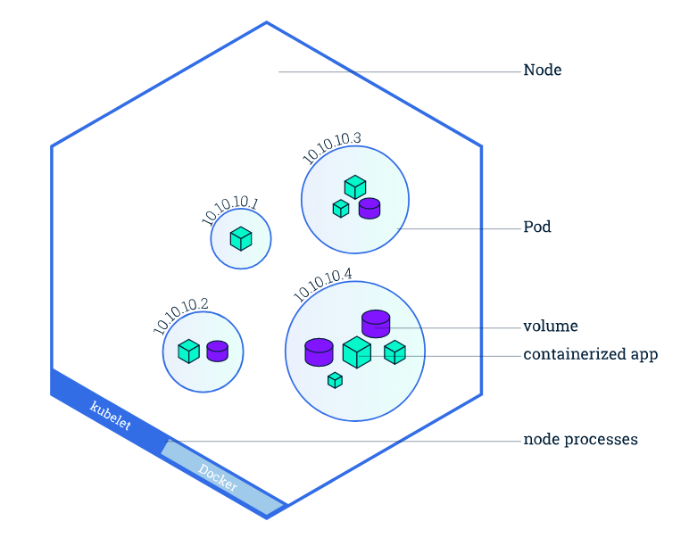
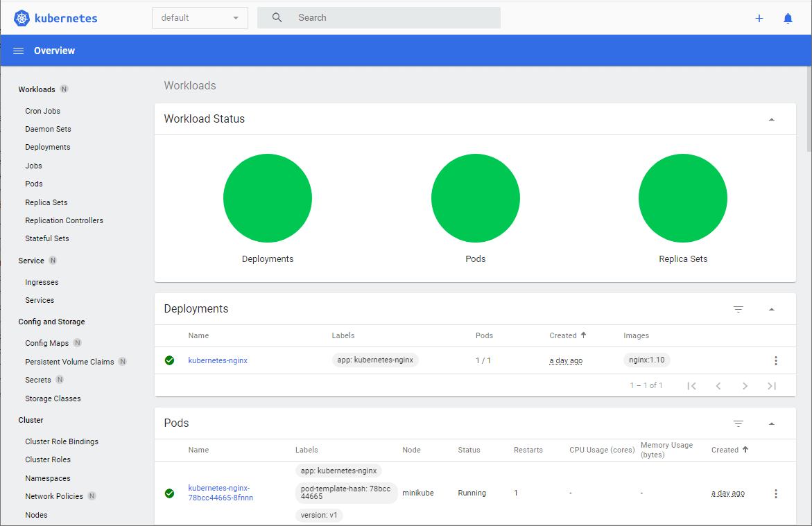
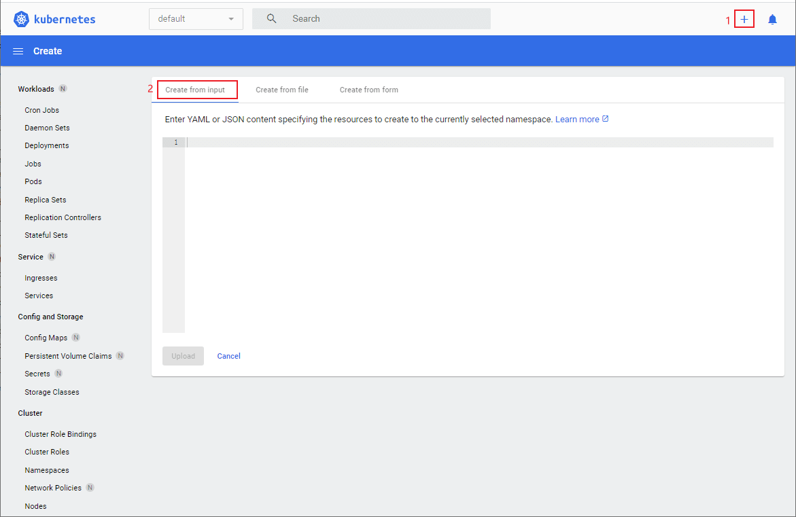
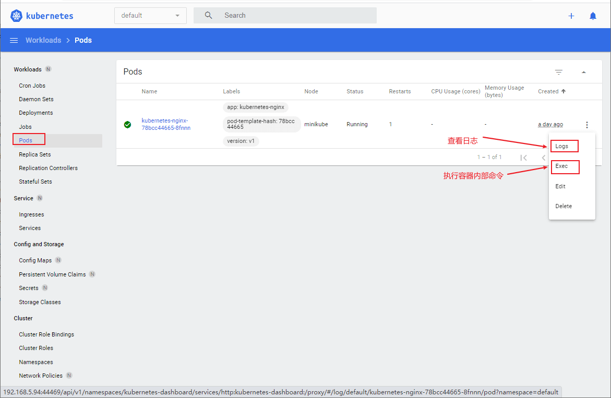

# K8S太火了！花10分钟玩转它不香么？

> 我的Mall电商实战项目一直使用的是Docker容器化部署，有很多朋友建议搞个Kubernetes部署。最近正好在学习Kubernetes，准备更新一波！今天我们先来学习下Kubernetes的核心概念和基本使用，希望对大家有所帮助！

## [#](https://www.macrozheng.com/k8s/k8s_start.html#kubernetes简介)Kubernetes简介

Kubernetes（简称K8S，K和S之间有8个字母）是用于自动部署，扩展和管理容器化应用程序的开源系统。它将组成应用程序的容器组合成逻辑单元，以便于管理和服务发现。Kubernetes 源自Google 15 年生产环境的运维经验，同时凝聚了社区的最佳创意和实践。

Kubernetes具有如下特性：

- 服务发现与负载均衡：无需修改你的应用程序即可使用陌生的服务发现机制。
- 存储编排：自动挂载所选存储系统，包括本地存储。
- Secret和配置管理：部署更新Secrets和应用程序的配置时不必重新构建容器镜像，且不必将软件堆栈配置中的秘密信息暴露出来。
- 批量执行：除了服务之外，Kubernetes还可以管理你的批处理和CI工作负载，在期望时替换掉失效的容器。
- 水平扩缩：使用一个简单的命令、一个UI或基于CPU使用情况自动对应用程序进行扩缩。
- 自动化上线和回滚：Kubernetes会分步骤地将针对应用或其配置的更改上线，同时监视应用程序运行状况以确保你不会同时终止所有实例。
- 自动装箱：根据资源需求和其他约束自动放置容器，同时避免影响可用性。
- 自我修复：重新启动失败的容器，在节点死亡时替换并重新调度容器，杀死不响应用户定义的健康检查的容器。

## [#](https://www.macrozheng.com/k8s/k8s_start.html#minikube简介)Minikube简介

Minikube是一种轻量级的Kubernetes实现，可在本地计算机上创建VM并部署仅包含一个节点的简单集群，Minikube可用于Linux、MacOS和Windows系统。Minikube CLI提供了用于引导集群工作的多种操作，包括启动、停止、查看状态和删除。

## [#](https://www.macrozheng.com/k8s/k8s_start.html#kubernetes核心概念)Kubernetes核心概念

> 由于Kubernetes有很多核心概念，学习它们对理解Kubernetes的使用很有帮助，所以我们先来学习下这些核心概念。

### [#](https://www.macrozheng.com/k8s/k8s_start.html#node)Node

Kubernetes集群是指Kubernetes协调一个高可用计算机集群，每个计算机作为独立单元互相连接工作。

一个Kubernetes集群包含两种类型的资源：

- Master：负责管理整个集群。协调集群中的所有活动，例如调度应用、维护应用的所需状态、应用扩容以及推出新的更新。
- Node：用于托管正在运行的应用。可以是一个虚拟机或者物理机，它在Kubernetes集群中充当工作机器的角色，每个Node都有Kubelet，它管理Node而且是Node与Master通信的代理，Node还具有用于处理容器操作的工具，例如Docker或rkt。



### [#](https://www.macrozheng.com/k8s/k8s_start.html#deployment)Deployment

Deployment负责创建和更新应用程序的实例。创建Deployment后，Kubernetes Master 将应用程序实例调度到集群中的各个节点上。如果托管实例的节点关闭或被删除，Deployment控制器会将该实例替换为群集中另一个节点上的实例。这提供了一种自我修复机制来解决机器故障维护问题。

可以使用Kubernetes命令行界面Kubectl创建和管理Deployment。Kubectl使用Kubernetes API与集群进行交互。



### [#](https://www.macrozheng.com/k8s/k8s_start.html#pod)Pod

Pod相当于`逻辑主机`的概念，负责托管应用实例。包括一个或多个应用程序容器（如 Docker），以及这些容器的一些共享资源（共享存储、网络、运行信息等）。



### [#](https://www.macrozheng.com/k8s/k8s_start.html#service)Service

Service是一个抽象层，它定义了一组Pod的逻辑集，并为这些Pod支持外部流量暴露、负载平衡和服务发现。

尽管每个Pod 都有一个唯一的IP地址，但是如果没有Service，这些IP不会暴露在群集外部。Service允许您的应用程序接收流量。Service也可以用在ServiceSpec标记type的方式暴露，type类型如下：

- ClusterIP（默认）：在集群的内部IP上公开Service。这种类型使得Service只能从集群内访问。
- NodePort：使用NAT在集群中每个选定Node的相同端口上公开Service。使用`<NodeIP>:<NodePort>`从集群外部访问Service。是ClusterIP的超集。
- LoadBalancer：在当前云中创建一个外部负载均衡器(如果支持的话)，并为Service分配一个固定的外部IP。是NodePort的超集。
- ExternalName：通过返回带有该名称的CNAME记录，使用任意名称（由spec中的externalName指定）公开Service。不使用代理。


## [#](https://www.macrozheng.com/k8s/k8s_start.html#docker安装)Docker安装

> 由于Kubernetes运行需要依赖`容器运行时`（负责运行容器的软件），现比较通用的容器运行时有Docker、containerd和CRI-O。这里选择Docker，先在Linux服务器上安装好Docker环境。

- 安装`yum-utils`：


```bash
yum install -y yum-utils device-mapper-persistent-data lvm2
```

- 为yum源添加docker仓库位置：


```bash
yum-config-manager --add-repo https://download.docker.com/linux/centos/docker-ce.repo
```

- 安装Docker：


```bash
yum install docker-ce
```

- 启动Docker：


```bash
systemctl start docker
```

## [#](https://www.macrozheng.com/k8s/k8s_start.html#minikube安装)Minikube安装

- 首先我们需要下载Minikube的二进制安装包并安装：


```bash
curl -LO https://storage.googleapis.com/minikube/releases/latest/minikube-linux-amd64
sudo install minikube-linux-amd64 /usr/local/bin/minikube
```

- 然后使用如下命令启动Minikube：


```bash
minikube start
```

- 如果你使用的是`root`用户的话会无法启动并提示如下信息，那是因为Minikube不允许使用root权限启动，需要创建一个非root账号再启动；


```bash
* minikube v1.16.0 on Centos 7.6.1810
* Automatically selected the docker driver
* The "docker" driver should not be used with root privileges.
* If you are running minikube within a VM, consider using --driver=none:
*   https://minikube.sigs.k8s.io/docs/reference/drivers/none/

X Exiting due to DRV_AS_ROOT: The "docker" driver should not be used with root privileges.
```

- 这里创建了一个属于`docker`用户组的`macro`用户，并切换到该用户；


```bash
# 创建用户
useradd -u 1024 -g docker macro
# 设置用户密码
passwd macro
# 切换用户
su macro
```

- 再次使用`minikube start`命令启动Minikube，启动成功后会显示如下信息：


```bash
* To pull new external images, you may need to configure a proxy: https://minikube.sigs.k8s.io/docs/reference/networking/proxy/
* Preparing Kubernetes v1.20.0 on Docker 20.10.0 ...
  - Generating certificates and keys ...
  - Booting up control plane ...
  - Configuring RBAC rules ...
* Verifying Kubernetes components...
* Enabled addons: default-storageclass, storage-provisioner
* kubectl not found. If you need it, try: 'minikube kubectl -- get pods -A'
* Done! kubectl is now configured to use "minikube" cluster and "default" namespace by default
```

## [#](https://www.macrozheng.com/k8s/k8s_start.html#kubernetes的使用)Kubernetes的使用

### [#](https://www.macrozheng.com/k8s/k8s_start.html#创建集群)创建集群

> 通过Minikube我们可以创建一个单节点的K8S集群，集群管理Master和负责运行应用的Node都部署在此节点上。

- 查看Minikube的版本号：


```bash
minikube version
```


```bash
minikube version: v1.16.0
commit: 9f1e482427589ff8451c4723b6ba53bb9742fbb1
```

- 查看kubectl的版本号，第一次使用会直接安装kubectl：


```bash
minikube kubectl version
```


```bash
Client Version: version.Info{Major:"1", Minor:"20", GitVersion:"v1.20.0", GitCommit:"af46c47ce925f4c4ad5cc8d1fca46c7b77d13b38", GitTreeState:"clean", BuildDate:"2020-12-08T17:59:43Z", GoVersion:"go1.15.5", Compiler:"gc", Platform:"linux/amd64"}
Server Version: version.Info{Major:"1", Minor:"20", GitVersion:"v1.20.0", GitCommit:"af46c47ce925f4c4ad5cc8d1fca46c7b77d13b38", GitTreeState:"clean", BuildDate:"2020-12-08T17:51:19Z", GoVersion:"go1.15.5", Compiler:"gc", Platform:"linux/amd64"}
```

- 如果你想直接使用kubectl命令的话，可以将其复制到`/bin`目录下去：


```bash
# 查找kubectl命令的位置
find / -name kubectl
# 找到之后复制到/bin目录下
cp /mydata/docker/volumes/minikube/_data/lib/minikube/binaries/v1.20.0/kubectl /bin/
# 直接使用kubectl命令
kubectl version
```

- 查看集群详细信息：


```bash
kubectl cluster-info
```


```bash
Kubernetes control plane is running at https://192.168.49.2:8443
KubeDNS is running at https://192.168.49.2:8443/api/v1/namespaces/kube-system/services/kube-dns:dns/proxy

To further debug and diagnose cluster problems, use 'kubectl cluster-info dump'.
```

- 查看集群中的所有Node，可以发现Minikube创建了一个单节点的简单集群：


```bash
kubectl get nodes
```


```bash
NAME       STATUS   ROLES                  AGE   VERSION
minikube   Ready    control-plane,master   46m   v1.20.0
```

### [#](https://www.macrozheng.com/k8s/k8s_start.html#部署应用)部署应用

> 一旦运行了K8S集群，就可以在其上部署容器化应用程序。通过创建Deployment对象，可以指挥K8S如何创建和更新应用程序的实例。

- 指定好应用镜像并创建一个Deployment，这里创建一个Nginx应用：


```bash
kubectl create deployment kubernetes-nginx --image=nginx:1.10
```

- 创建一个Deployment时K8S会产生如下操作：
  - 选择一个合适的Node来部署这个应用；
  - 将该应用部署到Node上；
  - 当应用异常关闭或删除时重新部署应用。
- 查看所有Deployment：


```bash
kubectl get deployments
```


```bash
NAME                  READY   UP-TO-DATE   AVAILABLE   AGE
kubernetes-nginx      1/1     1            1           21h
```

- 我们可以通过`kubectl proxy`命令创建一个代理，这样就可以通过暴露出来的接口直接访问K8S的API了，这里调用了查询K8S版本的接口；


```bash
[macro@linux-local root]$ kubectl proxy
Starting to serve on 127.0.0.1:8001
[root@linux-local ~]# curl http://localhost:8001/version
{
  "major": "1",
  "minor": "20",
  "gitVersion": "v1.20.0",
  "gitCommit": "af46c47ce925f4c4ad5cc8d1fca46c7b77d13b38",
  "gitTreeState": "clean",
  "buildDate": "2020-12-08T17:51:19Z",
  "goVersion": "go1.15.5",
  "compiler": "gc",
  "platform": "linux/amd64"
}
```

### [#](https://www.macrozheng.com/k8s/k8s_start.html#查看应用)查看应用

> 通过对运行应用的Pod进行操作，可以查看容器日志，也可以执行容器内部命令。

- 查看K8s中所有Pod的状态：


```bash
kubectl get pods
```


```bash
NAME                                   READY   STATUS             RESTARTS   AGE
kubernetes-nginx-78bcc44665-8fnnn      1/1     Running            1          21h
```

- 查看Pod的详细状态，包括IP地址、占用端口、使用镜像等信息；


```bash
kubectl describe pods
```


```bash
Name:         kubernetes-nginx-78bcc44665-8fnnn
Namespace:    default
Priority:     0
Node:         minikube/192.168.49.2
Start Time:   Tue, 05 Jan 2021 13:57:46 +0800
Labels:       app=kubernetes-nginx
              pod-template-hash=78bcc44665
              version=v1
Annotations:  <none>
Status:       Running
IP:           172.17.0.7
IPs:
  IP:           172.17.0.7
Controlled By:  ReplicaSet/kubernetes-nginx-78bcc44665
Containers:
  nginx:
    Container ID:   docker://31eb1277e507ec4cf8a27b66a9f4f30fb919d17f4cd914c09eb4cfe8322504b2
    Image:          nginx:1.10
    Image ID:       docker-pullable://nginx@sha256:6202beb06ea61f44179e02ca965e8e13b961d12640101fca213efbfd145d7575
    Port:           <none>
    Host Port:      <none>
    State:          Running
      Started:      Wed, 06 Jan 2021 09:22:40 +0800
    Last State:     Terminated
      Reason:       Completed
      Exit Code:    0
      Started:      Tue, 05 Jan 2021 14:24:55 +0800
      Finished:     Tue, 05 Jan 2021 17:32:48 +0800
    Ready:          True
    Restart Count:  1
    Environment:    <none>
    Mounts:
      /var/run/secrets/kubernetes.io/serviceaccount from default-token-dhr4b (ro)
Conditions:
  Type              Status
  Initialized       True 
  Ready             True 
  ContainersReady   True 
  PodScheduled      True 
Volumes:
  default-token-dhr4b:
    Type:        Secret (a volume populated by a Secret)
    SecretName:  default-token-dhr4b
    Optional:    false
QoS Class:       BestEffort
Node-Selectors:  <none>
Tolerations:     node.kubernetes.io/not-ready:NoExecute op=Exists for 300s
                 node.kubernetes.io/unreachable:NoExecute op=Exists for 300s
Events:          <none>
```

- 将Pod的名称设置为环境变量，方便之后使用`$POD_NAME`来应用Pod的名称：


```bash
export POD_NAME=kubernetes-nginx-78bcc44665-8fnnn
```

- 查看Pod打印的日志：


```bash
kubectl logs $POD_NAME
```

- 使用`exec`可以在Pod的容器中执行命令，这里使用`env`命令查看环境变量：


```bash
kubectl exec $POD_NAME -- env
```


```bash
PATH=/usr/local/sbin:/usr/local/bin:/usr/sbin:/usr/bin:/sbin:/bin
HOSTNAME=kubernetes-nginx-78bcc44665-8fnnn
KUBERNETES_PORT_443_TCP_ADDR=10.96.0.1
KUBERNETES_SERVICE_HOST=10.96.0.1
KUBERNETES_SERVICE_PORT=443
KUBERNETES_SERVICE_PORT_HTTPS=443
KUBERNETES_PORT=tcp://10.96.0.1:443
KUBERNETES_PORT_443_TCP=tcp://10.96.0.1:443
KUBERNETES_PORT_443_TCP_PROTO=tcp
KUBERNETES_PORT_443_TCP_PORT=443
NGINX_VERSION=1.10.3-1~jessie
HOME=/root
```

- 进入容器内部并执行`bash`命令，如果想退出容器可以使用`exit`命令：


```bash
kubectl exec -ti $POD_NAME -- bash
```

### [#](https://www.macrozheng.com/k8s/k8s_start.html#公开暴露应用)公开暴露应用

> 默认Pod无法被集群外部访问，需要创建Service并暴露端口才能被外部访问。

- 创建一个Service来暴露kubernetes-nginx这个Deployment：


```bash
kubectl expose deployment/kubernetes-nginx --type="NodePort" --port 80
```

- 查看K8S中所有Service的状态：


```bash
kubectl get services
```


```bash
NAME               TYPE        CLUSTER-IP       EXTERNAL-IP   PORT(S)        AGE
kubernetes         ClusterIP   10.96.0.1        <none>        443/TCP        5h16m
kubernetes-nginx   NodePort    10.105.177.114   <none>        80:31891/TCP   5s
```

- 查看Service的详情，通过`NodePort`属性可以得到暴露到外部的端口；


```bash
kubectl describe services/kubernetes-nginx
```


```bash
Name:                     kubernetes-nginx
Namespace:                default
Labels:                   app=kubernetes-nginx
Annotations:              <none>
Selector:                 app=kubernetes-nginx
Type:                     NodePort
IP Families:              <none>
IP:                       10.106.227.54
IPs:                      10.106.227.54
Port:                     <unset>  80/TCP
TargetPort:               80/TCP
NodePort:                 <unset>  30158/TCP
Endpoints:                172.17.0.7:80
Session Affinity:         None
External Traffic Policy:  Cluster
Events:                   <none>
```

- 通过CURL命令通过`Minikube IP:NodePort IP`可以访问Nginx服务，此时将打印Nginx主页信息；


```bash
curl $(minikube ip):30158
```


```html
<!DOCTYPE html>
<html>
<head>
<title>Welcome to nginx!</title>
<style>
    body {
        width: 35em;
        margin: 0 auto;
        font-family: Tahoma, Verdana, Arial, sans-serif;
    }
</style>
</head>
<body>
<h1>Welcome to nginx!</h1>
<p>If you see this page, the nginx web server is successfully installed and
working. Further configuration is required.</p>

<p>For online documentation and support please refer to
<a href="http://nginx.org/">nginx.org</a>.<br/>
Commercial support is available at
<a href="http://nginx.com/">nginx.com</a>.</p>

<p><em>Thank you for using nginx.</em></p>
</body>
</html>
```

### [#](https://www.macrozheng.com/k8s/k8s_start.html#标签的使用)标签的使用

> 通过给资源添加Label，可以方便地管理资源（如Deployment、Pod、Service等）。

- 查看Deployment中所包含的Label；


```bash
kubectl describe deployment
```


```bash
Name:                   kubernetes-nginx
Namespace:              default
CreationTimestamp:      Tue, 05 Jan 2021 13:57:46 +0800
Labels:                 app=kubernetes-nginx
Annotations:            deployment.kubernetes.io/revision: 1
Selector:               app=kubernetes-nginx
Replicas:               1 desired | 1 updated | 1 total | 1 available | 0 unavailable
StrategyType:           RollingUpdate
MinReadySeconds:        0
RollingUpdateStrategy:  25% max unavailable, 25% max surge
```

- 通过Label查询Pod：


```bash
kubectl get pods -l app=kubernetes-nginx
```


```bash
NAME                                READY   STATUS    RESTARTS   AGE
kubernetes-nginx-78bcc44665-8fnnn   1/1     Running   1          21h
```

- 通过Label查询Service：


```bash
kubectl get services -l app=kubernetes-nginx
```


```bash
NAME               TYPE       CLUSTER-IP      EXTERNAL-IP   PORT(S)        AGE
kubernetes-nginx   NodePort   10.106.227.54   <none>        80:30158/TCP   4m44s
```

- 给Pod添加Label：


```bash
kubectl label pod $POD_NAME version=v1
```

- 查看Pod的详细信息，可以查看Label信息：


```bash
kubectl describe pods $POD_NAME
```


```bash
Name:         kubernetes-nginx-78bcc44665-8fnnn
Namespace:    default
Priority:     0
Node:         minikube/192.168.49.2
Start Time:   Tue, 05 Jan 2021 13:57:46 +0800
Labels:       app=kubernetes-nginx
              pod-template-hash=78bcc44665
              version=v1
```

- 通过Label查询Pod：


```bash
kubectl get pods -l version=v1
```

- 通过Label删除服务：


```bash
kubectl delete service -l app=kubernetes-nginx
```


```bash
NAME               TYPE        CLUSTER-IP      EXTERNAL-IP   PORT(S)        AGE
kubernetes         ClusterIP   10.96.0.1       <none>        443/TCP        30h
```

### [#](https://www.macrozheng.com/k8s/k8s_start.html#可视化管理)可视化管理

> Dashboard是基于网页的K8S用户界面。你可以使用Dashboard将容器应用部署到K8S集群中，也可以对容器应用排错，还能管理集群资源。

- 查看Minikube内置插件，默认情况下Dashboard插件未启用：


```bash
minikube addons list
```


```text
|-----------------------------|----------|--------------|
|         ADDON NAME          | PROFILE  |    STATUS    |
|-----------------------------|----------|--------------|
| dashboard                   | minikube | disabled     |
| default-storageclass        | minikube | enabled ✅   |
|-----------------------------|----------|--------------|
```

- 启用Dashboard插件：


```bash
minikube addons enable dashboard
```

- 开启Dashboard，通过`--url`参数不会打开管理页面，并可以在控制台获得访问路径：


```bash
minikube dashboard --url
```


```bash
* Verifying dashboard health ...
* Launching proxy ...
* Verifying proxy health ...
http://127.0.0.1:44469/api/v1/namespaces/kubernetes-dashboard/services/http:kubernetes-dashboard:/proxy/
```

- 要想从外部访问Dashboard，需要从使用kubectl设置代理才行，`--address`设置为你的服务器地址；


```bash
kubectl proxy --port=44469 --address='192.168.5.94' --accept-hosts='^.*' &
```

- 从外部访问服务器需要开启防火墙端口；


```bash
# 切换到root用户
su -
# 开启端口
firewall-cmd --zone=public --add-port=44469/tcp --permanent
# 重启防火墙
firewall-cmd --reload
```

- 通过如下地址即可访问Dashboard：


```text
http://192.168.5.94:44469/api/v1/namespaces/kubernetes-dashboard/services/http:kubernetes-dashboard:/proxy/
```

- 查看K8S集群中的资源状态信息：



- 通过yaml脚本创建K8S资源：



- 查看K8S中所有Pod的状态信息，通过更多按钮可以查看容器日志和执行内部命令。



## [#](https://www.macrozheng.com/k8s/k8s_start.html#总结)总结

当我们的应用需要部署在多个物理机上时，传统的做法是一个个物理机器去部署。如果我们使用了K8S的话，就可以把这些物理机认为是一个集群，只需通过K8S把应用部署到集群即可，无需关心物理机的部署细节。同时K8S提供了水平扩容、自动装箱、自动修复等功能，大大减少了应用集群化部署的工作量。

## [#](https://www.macrozheng.com/k8s/k8s_start.html#参考资料)参考资料

官方文档：https://kubernetes.io/zh/docs/home/