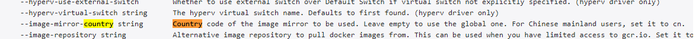

# minikube start命令的国内使用方法

## 问题 ##

我们可以使用官方提供的 minikube 安装单机版的k8s，查看文档 https://minikube.sigs.k8s.io/docs/start/，在执行 minikube start 命令时会有如下报错



```
[minikube@localhost docker]$ minikube start 

* minikube v1.17.1 on Centos 7.9.2009
* Automatically selected the docker driver
* Starting control plane node minikube in cluster minikube
* Pulling base image ...
E0224 05:53:36.304853   30819 cache.go:180] Error downloading kic artifacts:  failed to download kic base image or any fallback image
* Creating docker container (CPUs=2, Memory=2200MB) ...
! StartHost failed, but will try again: creating host: create: creating: setting up container node: preparing volume for minikube container: docker run --rm --entrypoint /usr/bin/test -v minikube:/var gcr.io/k8s-minikube/kicbase:v0.0.17@sha256:1cd2e039ec9d418e6380b2fa0280503a72e5b282adea674ee67882f59f4f546e -d /var/lib: exit status 125
stdout:

stderr:
Unable to find image 'gcr.io/k8s-minikube/kicbase:v0.0.17@sha256:1cd2e039ec9d418e6380b2fa0280503a72e5b282adea674ee67882f59f4f546e' locally
docker: Error response from daemon: Get https://gcr.io/v2/: net/http: request canceled while waiting for connection (Client.Timeout exceeded while awaiting headers).
See 'docker run --help'.

* docker "minikube" container is missing, will recreate.
* Creating docker container (CPUs=2, Memory=2200MB) ...
* Failed to start docker container. Running "minikube delete" may fix it: recreate: creating host: create: creating: setting up container node: preparing volume for minikube container: docker run --rm --entrypoint /usr/bin/test -v minikube:/var gcr.io/k8s-minikube/kicbase:v0.0.17@sha256:1cd2e039ec9d418e6380b2fa0280503a72e5b282adea674ee67882f59f4f546e -d /var/lib: exit status 125
stdout:

stderr:
Unable to find image 'gcr.io/k8s-minikube/kicbase:v0.0.17@sha256:1cd2e039ec9d418e6380b2fa0280503a72e5b282adea674ee67882f59f4f546e' locally
docker: Error response from daemon: Get https://gcr.io/v2/: net/http: request canceled while waiting for connection (Client.Timeout exceeded while awaiting headers).
See 'docker run --help'.

! Startup with docker driver failed, trying with alternate driver ssh: Failed to start host: recreate: creating host: create: creating: setting up container node: preparing volume for minikube container: docker run --rm --entrypoint /usr/bin/test -v minikube:/var gcr.io/k8s-minikube/kicbase:v0.0.17@sha256:1cd2e039ec9d418e6380b2fa0280503a72e5b282adea674ee67882f59f4f546e -d /var/lib: exit status 125
stdout:

stderr:
Unable to find image 'gcr.io/k8s-minikube/kicbase:v0.0.17@sha256:1cd2e039ec9d418e6380b2fa0280503a72e5b282adea674ee67882f59f4f546e' locally
docker: Error response from daemon: Get https://gcr.io/v2/: net/http: request canceled while waiting for connection (Client.Timeout exceeded while awaiting headers).
See 'docker run --help'.

* Deleting "minikube" in docker ...
* Removing /home/minikube/.minikube/machines/minikube ...
* Removed all traces of the "minikube" cluster.
* Starting control plane node minikube in cluster minikube
E0224 05:55:29.007297   30819 cache.go:180] Error downloading kic artifacts:  failed to download kic base image or any fallback image
! StartHost failed, but will try again: config: please provide an IP address
* Failed to start ssh bare metal machine. Running "minikube delete" may fix it: config: please provide an IP address

X Exiting due to GUEST_PROVISION: Failed to start host: recreate: creating host: create: creating: setting up container node: preparing volume for minikube container: docker run --rm --entrypoint /usr/bin/test -v minikube:/var gcr.io/k8s-minikube/kicbase:v0.0.17@sha256:1cd2e039ec9d418e6380b2fa0280503a72e5b282adea674ee67882f59f4f546e -d /var/lib: exit status 125
stdout:

stderr:
Unable to find image 'gcr.io/k8s-minikube/kicbase:v0.0.17@sha256:1cd2e039ec9d418e6380b2fa0280503a72e5b282adea674ee67882f59f4f546e' locally
docker: Error response from daemon: Get https://gcr.io/v2/: net/http: request canceled while waiting for connection (Client.Timeout exceeded while awaiting headers).
See 'docker run --help'.

* 
* If the above advice does not help, please let us know: 
  - https://github.com/kubernetes/minikube/issues/new/choose
```


这是由于k8s使用的 docker Registry是google container register，在国内是不能访问的，所以image会拉取失败。

## 解决办法 ##

经过多番查找，发现官方文档中有介绍解决办法，而且非常简单，


命令后添加镜像地区参数，即 minikube start --image-mirror-country='cn'
此时会拉取阿里的镜像仓库.

```
$ minikube delete --all
* Deleting "minikube" in docker ...
* Removing /home/minikube/.minikube/machines/minikube ...
* Removed all traces of the "minikube" cluster.
* Successfully deleted all profiles
[minikube@localhost docker]$ minikube start --image-mirror-country='cn'
* minikube v1.17.1 on Centos 7.9.2009
* Automatically selected the docker driver
* Using image repository registry.cn-hangzhou.aliyuncs.com/google_containers
* Starting control plane node minikube in cluster minikube
* Pulling base image ...
* Creating docker container (CPUs=2, Memory=2200MB) ...
! This container is having trouble accessing https://registry.cn-hangzhou.aliyuncs.com/google_containers
* To pull new external images, you may need to configure a proxy: https://minikube.sigs.k8s.io/docs/reference/networking/proxy/
* Preparing Kubernetes v1.20.2 on Docker 20.10.2 ...
  - Generating certificates and keys ...
  - Booting up control plane ...
  - Configuring RBAC rules ...
* Verifying Kubernetes components...
* Enabled addons: default-storageclass, storage-provisioner
* kubectl not found. If you need it, try: 'minikube kubectl -- get pods -A'
* Done! kubectl is now configured to use "minikube" cluster and "default" namespace by default
[minikube@localhost docker]$ minikube kubectl -- get pods -A
    > kubectl.sha256: 64 B / 64 B [--------------------------] 100.00% ? p/s 0s
    > kubectl: 13.51 MiB / 38.37 MiB [--->_____] 35.22% 9.38 KiB p/s ETA 45m14s^C
  > [minikube@localhost docker]$ minikube kubectl -- get pods -A
* The control plane node must be running for this command
  - To start a cluster, run: "minikube start"
```

成功！

还有一种方法是找到minikute当前版本对应的镜像tag，自己通过代理手动下载，操作过于麻烦，我没有尝试，但是理论上是可行的。

## 教训 ##

自己摸索+搜索网上教程花了2个多小时都没有解决，可是这个解决办法官方文档清清楚楚的写着，
如果第一时间能够翻一遍文档，问题很快就能解决。

所以，学习新框架，工具的时候，第一时间还是要全篇翻阅一下文档。免得耽误大量时间精力。

这里还要点赞 k8s的文档和阿里云，解决了中国开发人员的痛点。

————————————————

版权声明：本文为CSDN博主「Honins」的原创文章，遵循CC 4.0 BY-SA版权协议，转载请附上原文出处链接及本声明。

原文链接：https://blog.csdn.net/Honnyee/article/details/114059004